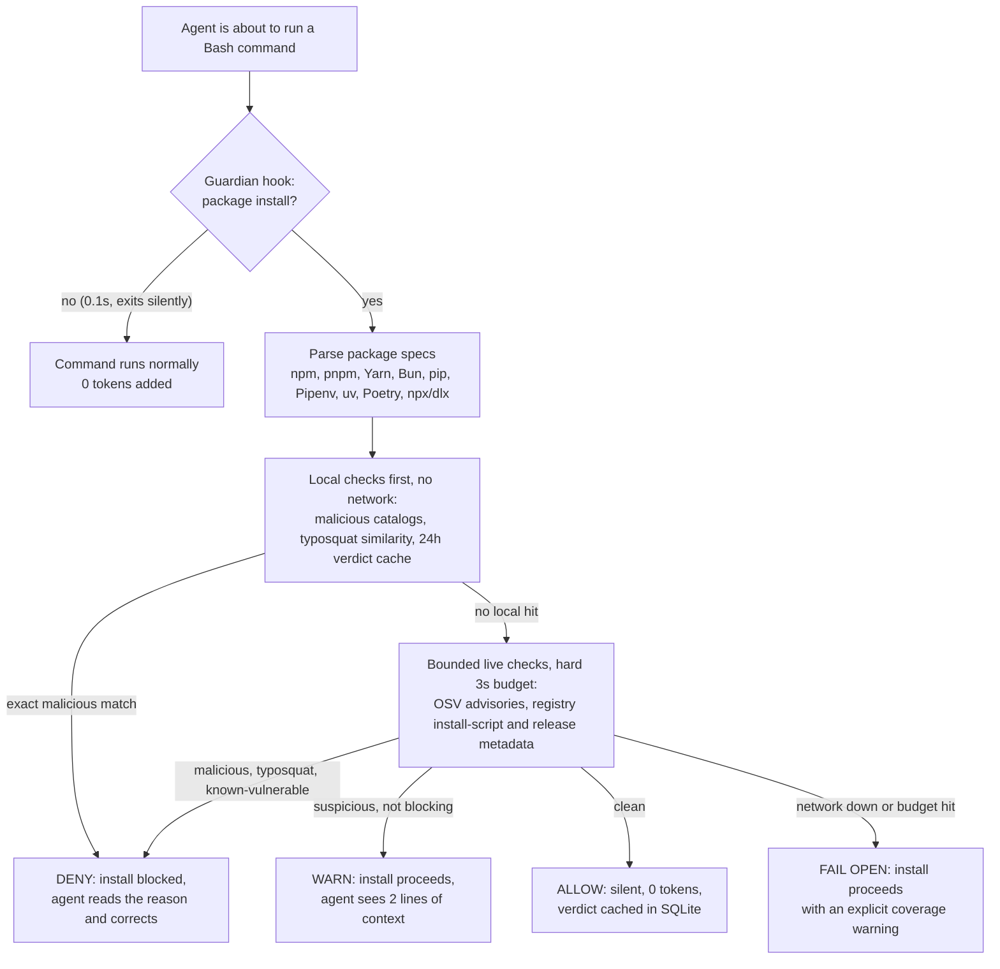

# Guardian

**Local-first dependency security for AI coding agents.** Guardian gives Codex and Claude Code a read-only security workflow for npm, Python, Go, Rust, and Composer projects: it checks npm and Python packages *before* they are installed, scans all five ecosystems against advisory and malicious-package intelligence, watches for suspicious dependency behavior over time, and explains what actually matters without recommending pointless dependency churn. See [Ecosystem Coverage](#ecosystem-coverage) for exactly which feature applies where.

[](https://github.com/gateway/guardian/actions/workflows/release-check.yml)
[](LICENSE)
[](docs/TRUST_MODEL.md)
[](#install-in-claude-code)
[](#install-in-codex)

## What it looks like

Your agent types `npm install lodahs` (note the typo). Guardian's pre-install hook stops it before anything is fetched:

```text
Guardian paused this install for package-risk review.
- lodahs: Package name is unusually similar to popular npm package 'lodash'
  (rank 145). Verify the spelling and publisher before installation.
```

The same check is available as a skill or CLI verdict (trimmed real output):

```json
{
  "verdict": "block",
  "name": "lodahs",
  "resolved_version": "0.0.1-security",
  "explanation": "Blocked by OSV/OpenSSF malicious-package evidence for this exact version.",
  "signals": [
    {"signal_type": "typosquat-suspected", "signal_grade": "behavioral-high",
     "similar_package": "lodash", "edit_distance": 1},
    {"signal_type": "malicious-package-match", "signal_grade": "catalog-match",
     "id": "MAL-2025-25502", "source": "osv-malicious"}
  ]
}
```

Legitimate installs pass through untouched. Network failures fail open with an explicit coverage warning — Guardian never leaves you unable to install.

## Contents

- [What Guardian Does](#what-guardian-does)
- [Ecosystem Coverage](#ecosystem-coverage)
- [How Guardian Compares](#how-guardian-compares)
- [Install In Codex](#install-in-codex)
- [Install In Claude Code](#install-in-claude-code)
- [Test Your First Repo](#test-your-first-repo)
- [Check Before Installing](#check-before-installing)
- [Skills And When To Use Them](#skills-and-when-to-use-them)
- [Automation](#automation)
- [Intelligence Sources](#intelligence-sources)
- [Efficient By Default](#efficient-by-default)
- [More Documentation](#more-documentation)
- [What Guardian Does Not Do](#what-guardian-does-not-do)

## What Guardian Does

- Checks proposed packages before installation, including probable typosquats, published advisories, install behavior, and exact malicious-catalog matches.
- Inventories npm, Python, Go, Rust, and Composer dependency evidence from manifests, lockfiles, and optional installed metadata.
- Matches exact package versions against vulnerability, exploit-intelligence, and malicious-package sources.
- Detects when a dependency newly gains install-time behavior, including npm lifecycle scripts and selected Python source-install evidence.
- Detects unapproved npm lockfile hosts, same-version integrity drift, direct dependency URLs, and incomplete Python pin/hash hygiene without network access.
- Reviews newly adopted registry versions for recent publication, maintainer drift, disappeared provenance, deprecation/yanking, and repository changes.
- Separates direct runtime risk from transitive, vendored metadata, test-only, tooling-only, and isolated-environment noise.
- Tracks scans over time so you can see new, resolved, changed, and unchanged findings.
- Produces compact operator JSON and optional Markdown handoff reports for agents, maintainers, and reviewers.
- Includes a package-diet workflow for unused, replaceable, or license-safe Vendor Candidate dependencies using lockfile footprint and cached maintenance evidence.
- Helps prepare maintainer-friendly advisory PRs only when the evidence supports a real fix.

Guardian does not edit dependency files, install project dependencies, or execute arbitrary project code during normal scans.

```text
Project evidence
  -> read-only inventory
  -> normalized package versions
  -> advisory and exploit-intelligence matching
  -> behavioral drift detection (install scripts, lockfile tamper, registry metadata)
  -> project-context corroboration
  -> prioritized findings
  -> operator summary, handoff report, and snapshot comparison
```

Guardian is evidence-first. It should not tell an agent to upgrade a package unless the package version, advisory match, dependency context, and project evidence support that recommendation.

## Ecosystem Coverage

Not every feature applies to every ecosystem. Guardian's rule is to say exactly what it checked, so here is the current matrix:

| Capability | npm | PyPI | Go | Rust (crates.io) | Composer |
|---|:---:|:---:|:---:|:---:|:---:|
| Inventory + advisory/malicious-package matching | ✅ | ✅ | ✅ | ✅ | ✅ |
| Pre-install gate + `guardian-check-package` | ✅ | ✅ | — | — | — |
| Typosquat / slopsquat detection | ✅ | ✅ | — | — | — |
| Install-time behavior signals | ✅ lifecycle scripts | ✅ sdist / direct-URL | n/a¹ | — | — |
| Same-version lockfile integrity drift | ✅ | hash/pin hygiene | ✅ | ✅ | ✅ |
| Unapproved lockfile registry hosts | ✅ | — | — | — | — |
| Registry behavioral metadata (release age, maintainers, provenance) | ✅ | ✅ | — | — | — |
| Package diet / vendor review | ✅ | — | — | — | — |

¹ Go module fetches do not execute code at install time, so there is no install-script surface to watch.

In short: Go, Rust, and Composer get read-only inventory, exact-version advisory and malicious-package matching (via OSV), direct-versus-transitive context, and lockfile checksum drift detection. The pre-install gate, typosquat checks, and registry behavioral intelligence currently cover npm and PyPI package additions only — `go get` and `cargo add` are not intercepted yet. Rust is the priority for gate expansion because `build.rs` and proc-macros execute arbitrary code at build time, the direct analog of npm lifecycle scripts.

## How Guardian Compares

Guardian overlaps with existing tools but sits in a different spot: it is built for the moment an AI agent is about to change your dependency graph.

- **`npm audit` / `pip-audit`**: single-ecosystem, advisory-only, stateless. Guardian is cross-ecosystem, adds malicious-package catalogs and exploit intelligence (KEV/EPSS), remembers previous scans so unchanged findings are not re-explained, and detects behavioral drift advisories have not caught up with yet.
- **Dependabot / Renovate**: repo-hosted and PR-driven, reacting after dependencies change. Guardian runs locally, gates the install *before* it happens, and separates credible exposure from vendored-metadata and test-only noise instead of opening a PR for every advisory.
- **Hosted supply-chain services**: powerful, but they are services — your dependency graph goes to someone else's cloud. Guardian is local-first with no telemetry, its scanner runtime is Python standard library only, and its state lives in a SQLite file you own. The only outbound traffic is to the documented public advisory and registry sources.

If you already use those tools, Guardian complements them: it is the layer that sits inside your coding agent.

## Install In Codex

### Codex Desktop

Open **Plugins** in the Codex app. If your app exposes an add-marketplace or add-repository flow, add Guardian with:

- Marketplace or GitHub repo: `gateway/guardian`
- Plugin to install: `guardian-security-scan`

If the app does not expose that source flow, use the Codex CLI commands below once from Terminal, then restart Codex or start a new thread so the Guardian skills are loaded.

### Codex CLI

Run these commands in Terminal. The install is two steps because Codex first adds the Guardian marketplace source, then installs the plugin from that marketplace.

`gateway/guardian` is GitHub shorthand for `https://github.com/gateway/guardian`. Codex reads this repo's `.agents/plugins/marketplace.json`; that file names the marketplace `guardian` and points the `guardian-security-scan` plugin at `./plugins/guardian-security-scan`.

1. Add the Guardian marketplace:

```bash
codex plugin marketplace add gateway/guardian --ref main
```

2. Install the Guardian plugin:

```bash
codex plugin add guardian-security-scan@guardian
```

For local development from a checkout, use the local path instead of the GitHub marketplace:

```bash
git clone https://github.com/gateway/guardian.git
codex plugin marketplace add ./guardian
codex plugin add guardian-security-scan@guardian
```

## Install In Claude Code

### Claude Desktop / Claude Code UI

In Claude Code, type `/plugin` in the prompt box to open the plugin manager. Go to **Marketplaces**, add Guardian, then install the plugin:

- Plugin source or GitHub repo: `https://github.com/gateway/guardian`
- Plugin to install: `guardian-security-scan`

Claude skills are namespaced after install, for example `guardian-security-scan:guardian-project-scan`.

### Claude Code Prompt Commands

These are Claude Code slash commands. Paste them into a Claude Code prompt, not your shell. The install is two steps: add the Guardian marketplace, then install the plugin.

`gateway/guardian` is GitHub shorthand for `https://github.com/gateway/guardian`. Claude Code reads this repo's `.claude-plugin/marketplace.json`; that file names the marketplace `guardian` and points the `guardian-security-scan` plugin at `./plugins/guardian-security-scan`.

1. Add the Guardian marketplace:

```text
/plugin marketplace add gateway/guardian
```

2. Install the Guardian plugin:

```text
/plugin install guardian-security-scan@guardian
```

Run `/reload-plugins` or start a new Claude Code session after installing.

Guardian's Claude skills are namespaced:

- `guardian-security-scan:guardian-check-package`
- `guardian-security-scan:guardian-project-scan`
- `guardian-security-scan:guardian-daily-watch`
- `guardian-security-scan:guardian-repo-scout`
- `guardian-security-scan:guardian-package-diet`
- `guardian-security-scan:guardian-advisory-pr`

For Claude-specific install and validation notes, see [`docs/CLAUDE_CODE.md`](docs/CLAUDE_CODE.md).

## Test Your First Repo

After installing, open Codex or Claude in a project you want to scan and use one of these prompts:

Codex:

> $guardian-security-scan:guardian-project-scan Scan this project read-only. Do not edit files, install dependencies, or run project code. Give me the operator summary, top findings, and any suggested next steps.

Claude Code:

> /guardian-security-scan:guardian-project-scan Scan this project read-only. Do not edit files, install dependencies, or run project code. Give me the operator summary, top findings, and any suggested next steps.

A good first scan should report:

- Current posture, such as `0 act now`, `1 fix this week`, or `watch`.
- Whether findings are runtime-linked, transitive, vendored metadata, test-only, or isolated.
- Advisory links and severity when a package matches a known issue.
- What changed compared with the previous scan if this repo has been scanned before.
- Paths to any operator JSON or Markdown handoff artifacts.

If you are testing from a Guardian checkout instead of an installed plugin, run:

```bash
./plugins/guardian-security-scan/scripts/guardian scan /path/to/repo --mode daily --output compact --json
```

Use Sonnet with low or normal effort for routine scan summaries. Guardian does the dependency scan locally; higher-reasoning models are usually unnecessary for install verification.

## Check Before Installing

The pre-install gate covers npm and PyPI package additions ([other ecosystems](#ecosystem-coverage) are covered by scans and advisory matching, not install interception). Guardian registers a bounded `PreToolUse` hook that recognizes common npm, pnpm, Yarn, Bun, pip, Pipenv, uv, and Poetry install forms — including manager flags before the subcommand, versioned Python executables, npm aliases, package-execution commands (`npx`, `npm exec`, `pnpx`, `pnpm dlx`, `yarn dlx`, `bunx`, `bun x`), multiple packages per command, and bounded `sh`/`bash`/`zsh -c` wrappers.

You can also ask for the check explicitly before an install:

Codex:

> $guardian-security-scan:guardian-check-package Check `npm react@19.1.0` before I install it. Give me the verdict, strongest evidence, source coverage, and safe next action. Do not install it.

Claude Code:

> /guardian-security-scan:guardian-check-package Check `npm react@19.1.0` before I install it. Give me the verdict, strongest evidence, source coverage, and safe next action. Do not install it.

How verdicts behave:

- Exact malicious-catalog matches **block**.
- Probable typosquats, known vulnerable versions, and opaque remote-source installs **pause for review**.
- Local filesystem dependencies (for example `pip install -e .`) are **allowed** with an informational note.
- Network failure remains **fail-open** with an explicit coverage warning — and an incomplete check is never cached as a clean verdict, so the next attempt re-checks instead of trusting a blind spot.

What Guardian knows at install time:

- For a newly requested package, Guardian checks the package name and exact resolved version against local malicious-package catalogs, typo-similarity data, registry metadata, and live OSV advisory data within a small time budget.
- If those sources already know the package/version is malicious or vulnerable, Guardian blocks or pauses before the install runs.
- If no source has evidence yet, Guardian may allow the install. That is not a claim that the package is safe from unknown zero-days; it means Guardian did not find known evidence in the sources it could reach at that moment.
- For packages you already have, Guardian learns about newly published advisories when you run a project scan or scheduled daily watch. There is no background daemon continuously checking your machine.

If Guardian pauses a legitimately similar package name, silence it permanently with `guardian policy accept-name <ecosystem> <name>`. To disable or tune the gate (including which signal grades hard-block), edit `preinstall_gate_enabled` and `preinstall_gate_block_grades` in `~/.guardian-security-scan/config.json`. Full details, false-positive guidance, and verdict semantics: [`docs/PREINSTALL_GATE.md`](docs/PREINSTALL_GATE.md).

### Under The Hood

Guardian is not an antivirus: there is no daemon, no background file scanning, and no network chatter while you work. It is a checkpoint that fires only at the moment your agent is about to run a command, using the harness's own `PreToolUse` hook mechanism:



Measured on the shipped hook (Apple-silicon laptop; reproduce by piping a `PreToolUse` JSON event into `hooks/preinstall_gate.py` and timing it):

| Path | Added latency | Tokens into agent context |
|---|---|---|
| Any non-install command | ~0.1 s | 0 |
| Clean install, first check (live OSV + registry) | ~1.6 s | 0 |
| Clean install, repeat (SQLite cache) | ~0.09 s | 0 |
| Deny / warn | — | ~75 (capped at 5 packages per message) |

The token math is structural, not tuned: the hook runs as a local process outside the model, so the only time it adds anything to your context is when it has something to say. A deny costs about two lines — the hallucinated-package debugging session it replaces costs a lot more.

## Skills And When To Use Them

Skill calls are slightly different by harness:

- Codex: use `$guardian-security-scan:skill-name`.
- Claude Code: use `/guardian-security-scan:skill-name`.
- Natural language usually works too, but the prefixed form is the clearest copy/paste option.

Standalone personal skills may have shorter names such as `$guarded-code`; Guardian skills are plugin skills, so they use the plugin namespace to avoid collisions with other installed skills.

### `guardian-check-package`

Use this before adding an npm or Python dependency. It returns a bounded, cached allow/warn/block verdict without installing the package.

Codex:

> $guardian-security-scan:guardian-check-package Check `pypi requests==2.32.4` before installation. Do not install it. Explain any typo, advisory, install-behavior, malicious-catalog, or source-coverage signal and tell me whether to proceed.

Claude Code:

> /guardian-security-scan:guardian-check-package Check `pypi requests==2.32.4` before installation. Do not install it. Explain any typo, advisory, install-behavior, malicious-catalog, or source-coverage signal and tell me whether to proceed.

### `guardian-project-scan`

Use this for normal project security scans, repeat scans, fix verification, and handoff reports.

Codex:

> $guardian-security-scan:guardian-project-scan Scan this project read-only. Do not edit files, install dependencies, or run project code. Compare this scan with the previous scan if one exists, then summarize the current posture, top actionable findings, advisory links, evidence context, and suggested next steps.

Claude Code:

> /guardian-security-scan:guardian-project-scan Scan this project read-only. Do not edit files, install dependencies, or run project code. Compare this scan with the previous scan if one exists, then summarize the current posture, top actionable findings, advisory links, evidence context, and suggested next steps.

### `guardian-daily-watch`

Use this for lightweight morning automation across known local repos. It fingerprints dependency files, skips unchanged inventory, and can refresh advisory data for known package inventories.

Codex:

> $guardian-security-scan:guardian-daily-watch Check my known local repos. Keep it lightweight, skip unchanged dependency inventories where possible, refresh advisory data for known packages if available, and summarize only new, resolved, changed, or high-priority findings.

Claude Code:

> /guardian-security-scan:guardian-daily-watch Check my known local repos. Keep it lightweight, skip unchanged dependency inventories where possible, refresh advisory data for known packages if available, and summarize only new, resolved, changed, or high-priority findings.

See [`docs/AUTOMATION.md`](docs/AUTOMATION.md) for scheduled scan strategy.

### `guardian-repo-scout`

Use this for temporary scans of public GitHub repos you do not own. Repo Scout uses disposable clones and temporary Guardian state by default, then reports high-signal findings and the recommended reporting path.

Codex:

> $guardian-security-scan:guardian-repo-scout Scan `owner/name` with temporary clones and temporary Guardian state. Do not install dependencies or run project code. Show only high-signal dependency findings, include advisory links and reporting-path guidance, and clean up temporary files when finished.

Claude Code:

> /guardian-security-scan:guardian-repo-scout Scan `owner/name` with temporary clones and temporary Guardian state. Do not install dependencies or run project code. Show only high-signal dependency findings, include advisory links and reporting-path guidance, and clean up temporary files when finished.

See [`docs/REPO_SCOUT.md`](docs/REPO_SCOUT.md) for the public-repo scouting workflow.

### `guardian-package-diet`

Use this for dependency bloat, unused packages, and "could simple local code replace this dependency?" review. This is separate from vulnerability scanning.

Codex:

> $guardian-security-scan:guardian-package-diet Analyze this repo for dependency bloat. Identify unused, replace-with-native, and license-safe Vendor Candidates. Include exact usage locations, lockfile transitive footprint, cached size/maintenance evidence, removal risk, attribution requirements, and tests needed before any change.

Claude Code:

> /guardian-security-scan:guardian-package-diet Analyze this repo for dependency bloat. Identify unused, replace-with-native, and license-safe Vendor Candidates. Include exact usage locations, lockfile transitive footprint, cached size/maintenance evidence, removal risk, attribution requirements, and tests needed before any change.

### `guardian-advisory-pr`

Use this after Guardian confirms an actionable finding and you want a maintainer-friendly PR with advisory links, dependency evidence, fix rationale, and validation notes.

Codex:

> $guardian-security-scan:guardian-advisory-pr For this confirmed Guardian finding, run Guardian's outreach preflight first. If it permits a public PR, prepare the exact diff and maintainer-friendly draft with advisory evidence, dependency path, code usage, fix risk, validation, and a short "Powered by Guardian" note. Show me the final draft and diff and wait for my explicit confirmation before creating anything.

Claude Code:

> /guardian-security-scan:guardian-advisory-pr For this confirmed Guardian finding, run Guardian's outreach preflight first. If it permits a public PR, prepare the exact diff and maintainer-friendly draft with advisory evidence, dependency path, code usage, fix risk, validation, and a short "Powered by Guardian" note. Show me the final draft and diff and wait for my explicit confirmation before creating anything.

## Automation

Guardian stores local scan state in SQLite outside the plugin by default:

```text
~/.guardian-security-scan/guardian.db
```

That state lets Guardian compare scans across time and answer practical questions:

- Did a new advisory affect a package we already had?
- Did a dependency change introduce a new finding?
- Did a fix actually resolve the previous issue?
- Is this unchanged metadata noise that should not be re-explained every morning?

For morning checks, use `guardian-daily-watch`. It keeps scans cheap by hashing dependency manifests and lockfiles first, then only re-inventories repos whose dependency files changed. Add live advisory refresh when you want to check known packages against newly published data.

The daily watch refreshes advisory data for your existing packages by default, so a CVE published overnight against a dependency you already had surfaces the next morning — Guardian has no background daemon, so coverage is as fresh as your last scan.

To run it automatically every morning, put the daily-watch prompt into your harness's scheduler (Claude Code `/schedule` routines or the Codex equivalent) — [`docs/AUTOMATION.md`](docs/AUTOMATION.md) has a copy-paste prompt and a headless cron alternative. The scan work happens locally and the model only summarizes a compact delta, so scheduled runs are token-cheap and fine on a small model.

## Intelligence Sources

Guardian uses multiple sources because no single feed is complete:

- OSV
- GitHub Security Advisories
- CISA Known Exploited Vulnerabilities
- FIRST EPSS
- NVD enrichment
- GitLab Advisory Database ingest
- OpenSSF Malicious Packages via mode-gated sparse ingest
- npm and PyPI registry behavioral metadata for newly adopted versions
- Bundled exact-match public malicious-package campaign catalogs

Guardian verifies its own intelligence too: `guardian catalog verify` cross-checks every bundled catalog entry against OSV's malicious-package records and reports which entries are independently corroborated, and remote catalog refresh is fail-closed against a SHA-256 manifest pinned in the plugin.

Guardian reports what configured sources currently know about package versions it can see. It cannot prove a project is safe from unknown zero-days.

For source behavior, trust boundaries, and known limits, see [`docs/TRUST_MODEL.md`](docs/TRUST_MODEL.md).

## Efficient By Default

Guardian is designed to be lightweight for local agent workflows and scheduled scans:

- The scanner runtime uses the Python standard library only (no pip dependencies). Source-usage analysis shells out to ripgrep (`rg`); when it is missing, Guardian says so and downgrades usage-based conclusions instead of guessing.
- Normal reports are compact so agents read summaries instead of raw lockfiles.
- Daily watch skips unchanged dependency inventories.
- Unchanged daily-watch roots make zero registry-intelligence calls; standard scans skip registry enumeration on the first baseline.
- Live-source requests share bounded retry, pacing, and conditional disk caching so large feeds are not downloaded again while fresh.
- Exact-version pre-install verdicts are cached in SQLite for 24 hours by default; versionless checks always refresh the registry's current `latest` version.
- Live advisory refresh and installed-tree corroboration are explicit options.
- Repo Scout uses bounded, paced scans for large public repos.
- Snapshot comparison prevents repeated scans from re-explaining unchanged findings.
- Package-diet review is separate so bloat analysis does not inflate security output.

Default scans are intentionally conservative. Deeper live-source checks, installed-tree corroboration, and package usage scans are available when the situation justifies them.

## More Documentation

- [`docs/AUTOMATION.md`](docs/AUTOMATION.md): daily watch, freshness, and scan-state behavior.
- [`docs/CLI.md`](docs/CLI.md): direct CLI usage, scan modes, tokens, and local state.
- [`docs/PREINSTALL_GATE.md`](docs/PREINSTALL_GATE.md): package checks, hooks, verdicts, false positives, and fail-open behavior.
- [`plugins/guardian-security-scan/docs/SOURCES.md`](plugins/guardian-security-scan/docs/SOURCES.md): source matrix, freshness, authentication, registry privacy, and catalog integrity.
- [`docs/CLAUDE_CODE.md`](docs/CLAUDE_CODE.md): Claude Code install, validation, and smoke tests.
- [`docs/REPO_SCOUT.md`](docs/REPO_SCOUT.md): temporary public GitHub repo scouting.
- [`docs/TRUST_MODEL.md`](docs/TRUST_MODEL.md): security boundary, source model, and known limits.
- [`SECURITY.md`](SECURITY.md): vulnerability reporting and secret-handling guidance.

## What Guardian Does Not Do

- It does not prove a project has no unknown zero-days.
- It does not execute arbitrary project code during normal scans.
- It does not automatically edit or upgrade dependencies.
- It does not treat every transitive or vendored metadata finding as a production incident.
- It does not run as a background daemon or watch advisory feeds in real time. Coverage is as fresh as your last scan; the scheduled daily watch exists to keep that gap to one morning.
- It does not replace human review for high-impact security fixes.
